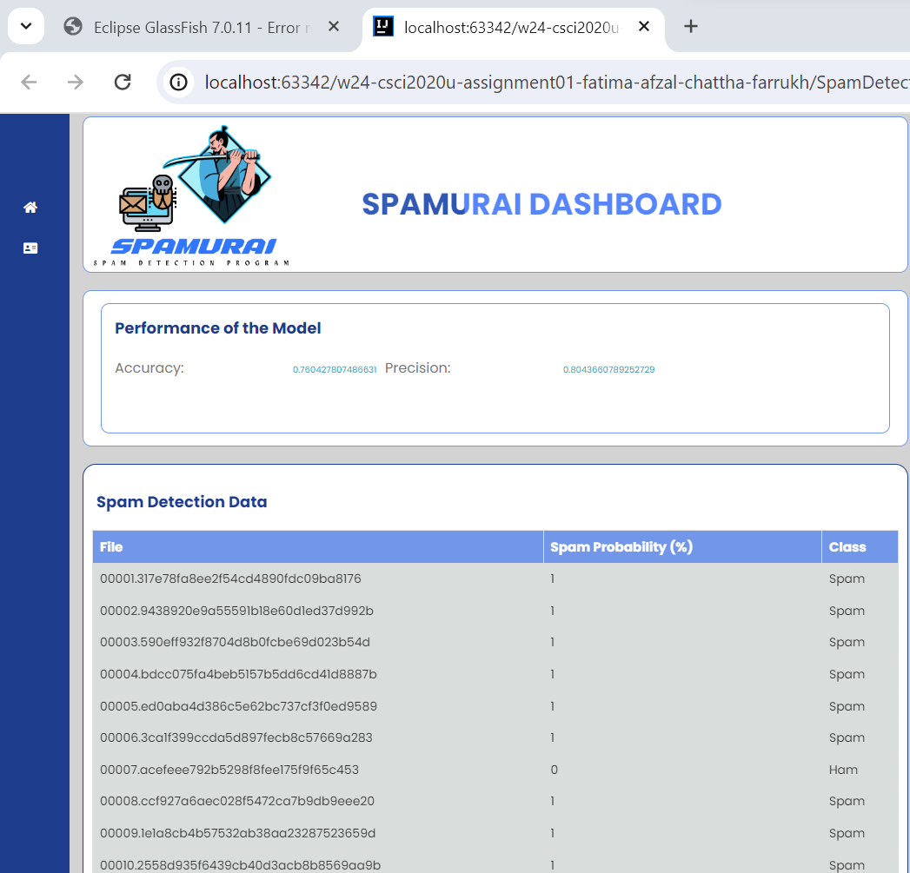

# Spam Detector SPAMURAI - Assignment 01
<p align="center">
  
</p>

### Project Information
We've taken the initiative to develop a program designed to sift through and eliminate spam emails. Our spam detector, <b><i>SPAMURAI</i></b>, employs a unigram approach, meticulously analyzing each word within an email to ascertain its spam status. SPAMURAI exhibits a remarkable ability to differentiate between spam & legitimate emails by calculating probabilities based on word frequency, ensuring high accuracy in its assessments. The system has been trained using a diverse dataset encompassing both spam and non-spam emails, and the SpamDetector class has been crafted to facilitate model reading, testing, and training. With a robust set of samples at its disposal, the program excels at sieving out unwanted messages. The algorithm boasts a % accuracy rate and a % precision rate, providing assurance of SPAMURAI's reliability.
<h3>A product of the combined skills & teamwork of <b>Manal Afzal, Zara Farrukh, Syeda Bisha Fatima & Rabia Chattha</b></h3>
<p align="center">
   
  
  
</p>


 

### Improvements
We enhanced the code by incorporating HashMaps and ArrayLists for efficient storage of data values, resulting in a time complexity of O(n) for value searches. Additionally, during the optimization stage, we found a way to eliminate an entire testing function and implemented the storage of test results (table) within the testAndTrain method, reducing code lines and redundancy. We also generalized a duplicate method and employed getters and setters for Accuracy and Precision to prevent the use of multiple variables. Furthermore, we introduced an isWord function to handle unique words and symbols, streamlining the code.

Given more time, we would further refine our algorithm by implementing Laplace Smoothing to effectively manage unseen words. Additionally, we aim to enhance the software to accommodate special characters and symbols.

### How to run

### Other Resources


### SpamDetectorServer - Endpoints

**Listing all the test files**

This will return a `application/json` content type.
- `http://localhost:8080/spamDetector-1.0/api/spam`
Here's an example illustrating what a sample response might resemble:
```
[{"spamProbRounded":"0.00000","file":"00006.654c4ec7c059531accf388a807064363","spamProbability":5.901245803391957E-62,"actualClass":"Ham"},{"spamProbRounded":"0.00000","file":"00007.2e086b13730b68a21ee715db145522b9","spamProbability":2.800348071907053E-12,"actualClass":"Ham"},{"spamProbRounded":"0.00000","file":"00008.6b73027e1e56131377941ff1db17ff12","spamProbability":8.66861037294167E-14,"actualClass":"Ham"},{"spamProbRounded":"0.00000","file":"00009.13c349859b09264fa131872ed4fb6e4e","spamProbability":6.947265471550557E-12,"actualClass":"Ham"},{"spamProbRounded":"0.00000","file":"00010.d1b4dbbad797c5c0537c5a0670c373fd","spamProbability":1.8814467288977145E-7,"actualClass":"Ham"},{"spamProbRounded":"0.00039","file":"00011.bc1aa4dca14300a8eec8b7658e568f29","spamProbability":3.892844289937937E-4,"actualClass":"Ham"}]
```

**Calculate and get accuracy**
This will return a `application/json` content type.
- `http://localhost:8080/spamDetector-1.0/api/spam/accuracy`
Here's an example illustrating what a sample response might resemble:
```
{"val": 0.87564}
```

**Calculate and get precision**
This will return a `application/json` content type.
- `http://localhost:8080/spamDetector-1.0/api/spam/precision`
Here's an example illustrating what a sample response might resemble:
```
{"val": 0.56484}
```
### SpamDetectorServer - SpamDetector class

Most of your programming will be in the `SpamDetector` class. This class will be responsible for reading the testing and training data files, training, and testing the model.

>1. Feel free to create other helper classes as you see fit.
> 
>2. You are not expected to get the exact same values as the ones shown in the samples.

### References 
[1] https://en.wikipedia.org/wiki/Bag-of-words_model 

[2] https://en.wikipedia.org/wiki/Naive_Bayes_spam_filtering 
